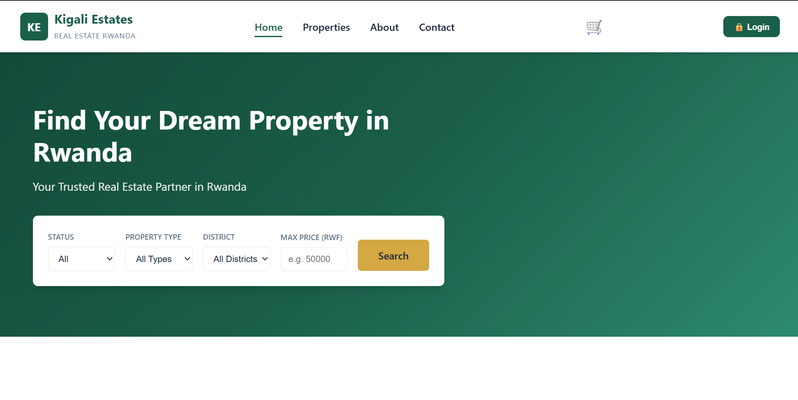
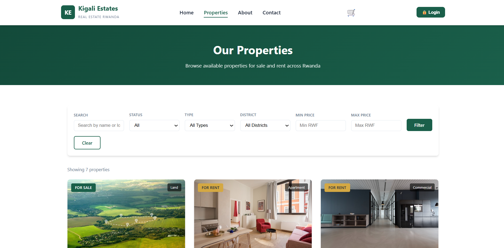
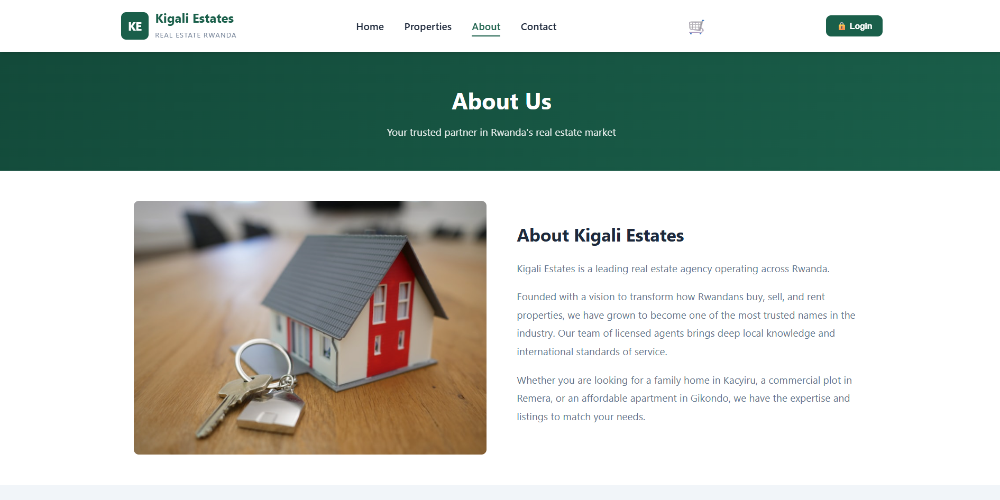
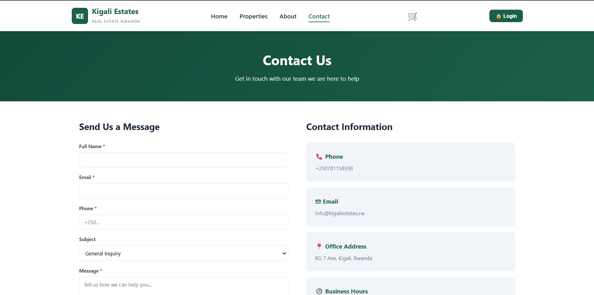
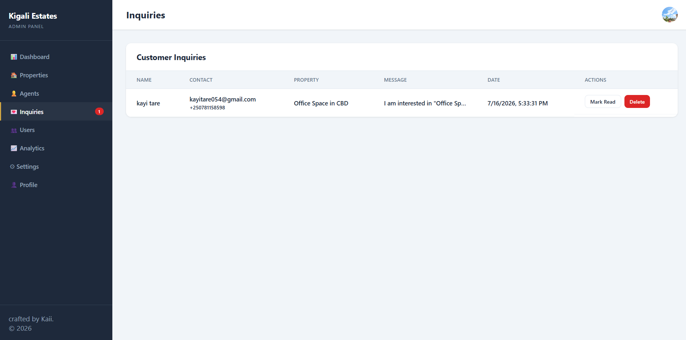
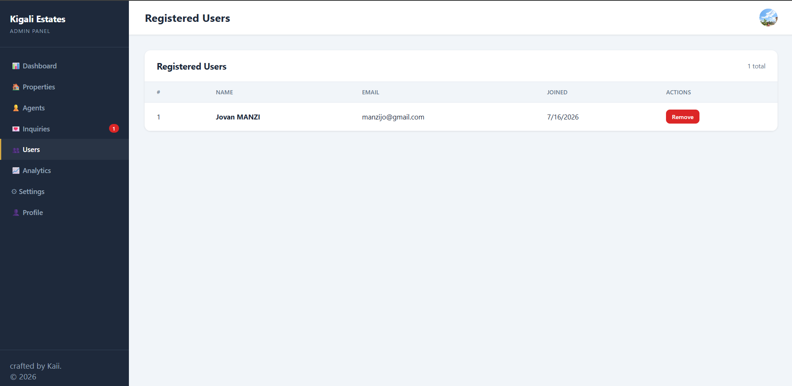
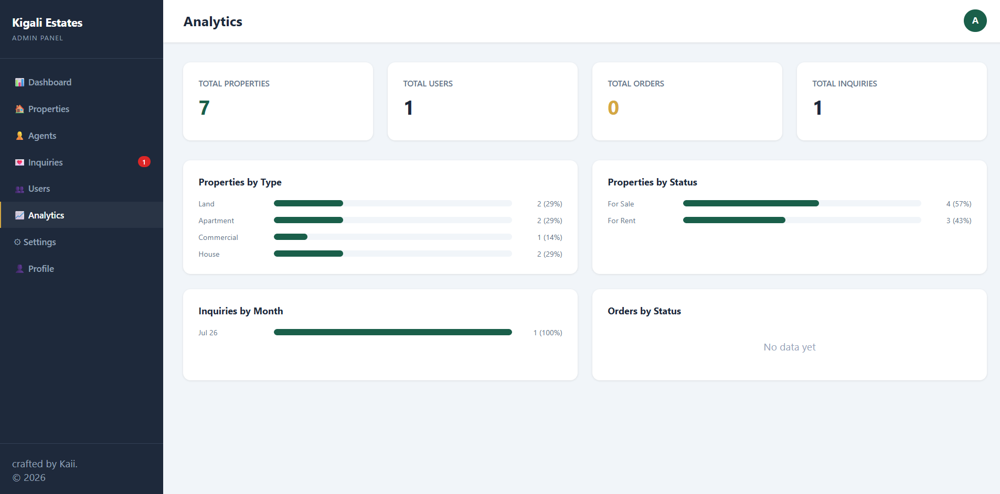

# Kigali Estates 🏠

A full-stack real estate e-commerce web application for browsing, listing, and managing properties across Rwanda.

## Live Demo

🔗 [https://kigali-estates.onrender.com](https://kigali-estates.onrender.com)

## GitHub Repository

🔗 [https://github.com/KAYITARE8/-kigali-estates](https://github.com/KAYITARE8/-kigali-estates)

---

## Screenshots

### Homepage


### Properties


### About


### Contact


### Admin Dashboard


### Inquiries


### Users


### Analytics


---

## Features

- Browse properties for sale and rent across Rwanda
- Filter by type, district, status, and price range
- Property detail pages with inquiry forms
- Shopping cart with quantity controls and totals
- Full checkout process with order confirmation
- User registration and login (bcrypt hashed passwords)
- Admin panel to manage properties, agents, inquiries, orders, users, and settings
- Inquiry workflow: mark as read → mark as done → moves to Done page → permanently delete
- Analytics dashboard with real-time stats and bar charts
- Admin profile management with photo upload
- NeDB database (persistent, pure JS — no native compilation required)
- Fully containerized with Docker
- CI/CD pipeline via GitHub Actions
- Deployed on Render

---

## Technologies Used

| Layer | Technology |
|---|---|
| Frontend | HTML5, CSS3, Vanilla JavaScript |
| Backend | Node.js, Express.js |
| Database | NeDB (`@seald-io/nedb`) |
| Authentication | bcryptjs (password hashing) |
| Containerization | Docker, Docker Compose |
| CI/CD | GitHub Actions |
| Deployment | Render |

---

## Project Structure

```
kigali-estates/
├── css/
│   ├── style.css          # Public site styles
│   └── admin.css          # Admin panel styles
├── js/
│   ├── storage.js         # API client (fetch-based)
│   ├── cart.js            # Shopping cart logic
│   ├── main.js            # Shared UI rendering
│   └── admin.js           # Admin panel logic
├── .github/
│   └── workflows/
│       └── deploy.yml     # CI/CD pipeline
├── data/                  # NeDB database files (gitignored)
├── index.html             # Homepage
├── properties.html        # Property listing
├── property.html          # Property detail
├── about.html             # About page
├── contact.html           # Contact page
├── cart.html              # Shopping cart
├── checkout.html          # Checkout form
├── confirmation.html      # Order confirmation
├── admin.html             # Admin dashboard
├── admin-login.html       # Admin login
├── server.js              # Express API server
├── db.js                  # NeDB database setup & seeding
├── package.json
├── Dockerfile
├── docker-compose.yml
├── render.yaml            # Render persistent disk config
└── .gitignore
```

---

## Database Design

NeDB stores data in flat files under `data/`. Collections:

- **properties.db** — id, title, type, status, price, currency, location, district, bedrooms, bathrooms, area, description, features, image, featured, createdAt
- **agents.db** — id, name, role, phone, email, photo
- **inquiries.db** — id, name, email, phone, message, propertyTitle, is_read, is_done, date
- **orders.db** — id, customer{firstName,lastName,email,phone,address,district}, items, total, paymentMethod, notes, status, createdAt
- **users.db** — id, name, email, password(hashed), createdAt
- **settings.db** — companyName, tagline, phone, email, address, whatsapp, about
- **admin.db** — id, username, password(hashed), name, photo

---

## API Endpoints

| Method | Endpoint | Description |
|---|---|---|
| GET | /api/properties | List all properties |
| GET | /api/properties/:id | Get single property |
| POST | /api/properties | Create property |
| PUT | /api/properties/:id | Update property |
| DELETE | /api/properties/:id | Delete property |
| GET | /api/agents | List all agents |
| POST | /api/agents | Create agent |
| PUT | /api/agents/:id | Update agent |
| DELETE | /api/agents/:id | Delete agent |
| GET | /api/inquiries | List all inquiries |
| POST | /api/inquiries | Submit inquiry |
| PUT | /api/inquiries/:id/read | Mark inquiry as read |
| PUT | /api/inquiries/:id/done | Mark inquiry as done (moves to Done page) |
| DELETE | /api/inquiries/:id | Delete inquiry permanently |
| GET | /api/settings | Get site settings |
| PUT | /api/settings | Update settings |
| POST | /api/register | Register new user |
| POST | /api/login | Unified login (admin + user) |
| GET | /api/admin | Get admin profile |
| PUT | /api/admin | Update admin profile & photo |
| GET | /api/users | List all users |
| DELETE | /api/users/:id | Delete user |
| GET | /api/orders | List all orders |
| GET | /api/orders/:id | Get single order |
| POST | /api/orders | Place order |
| PUT | /api/orders/:id/status | Update order status |
| DELETE | /api/orders/:id | Delete order |

---

## Admin Panel

- URL: `/admin-login.html` or use the 🔒 Login button on the homepage
- Default credentials set during first run via `db.js` seed

### Sections

| Section | Description |
|---|---|
| Dashboard | Overview stats, recent properties and inquiries |
| Properties | Add, edit, delete, and feature properties |
| Agents | Manage real estate agents |
| Inquiries | View and handle incoming customer inquiries |
| Users | View and remove registered user accounts |
| Done | Archive of handled inquiries — click Done to permanently remove |
| Analytics | Bar charts for properties by type/status, inquiries by month, orders by status |
| Settings | Update company info, contact details, and admin credentials |
| Profile | Update admin name, email, password, and photo |

### Inquiry Workflow

1. Customer submits inquiry → appears in **Inquiries** section (bold = unread)
2. Admin clicks **Mark Read** → removes bold styling
3. Admin clicks **Done** → inquiry moves to the **Done** section
4. In Done section, admin clicks **Done** button → permanently deletes the inquiry

---

## Running Locally

### Option 1 — Node.js

```bash
npm install
npm start
```
Open [http://localhost:3000](http://localhost:3000)

### Option 2 — Docker

```bash
docker-compose up --build
```
Open [http://localhost:3000](http://localhost:3000)

---

## CI/CD Pipeline

The GitHub Actions workflow (`.github/workflows/deploy.yml`) runs on every push to `main`:

1. Checkout code
2. Install Node.js 20 dependencies
3. Run tests (`npm test`)
4. Build Docker image
5. Trigger deployment to Render via deploy hook

---

## Deployment (Render)

1. Push code to GitHub
2. Create a new **Web Service** on [render.com](https://render.com)
3. Connect your GitHub repository
4. Set build command: `npm install`
5. Set start command: `node server.js`
6. Add environment variable: `PORT=3000`
7. Add a **Disk** with mount path `/app/data` (1GB) for persistent data
8. Copy the **Deploy Hook URL** and add it as a GitHub secret named `RENDER_DEPLOY_HOOK_URL`

---

## Docker

```bash
# Build
docker build -t kigali-estates .

# Run
docker run -p 3000:3000 kigali-estates

# Or with docker-compose (recommended — includes persistent volume)
docker-compose up --build
```

---

## Security

- Passwords hashed with **bcryptjs** (salt rounds: 10)
- Unified login endpoint checks admin first, then users
- Input validation on all forms (frontend + backend)
- Sessions stored in `sessionStorage` (cleared on tab close)

---

## Changelog

All changes are automatically deployed via the CI/CD pipeline on every push to `main`.

| Run | Commit | Description |
|---|---|---|
| #18 | `ae59e6b` | Update README with accurate project info, remove stray image files |
| #17 | `f90a1e4` | Stats section: use real DB counts for all 4 figures |
| #16 | `d5ec637` | Fix order inquiry: read from nested customer object |
| #15 | `dcb8a5e` | Auto-create inquiry from every order for admin visibility |
| #14 | `3d4df63` | Fix inquiries not showing: normalize propertyTitle field name |
| #13 | `2282942` | Fix: auto-login after signup, add render.yaml persistent disk for NeDB |
| #12 | `a0cf95d` | Remove login credentials hint from admin login page |
| #11 | `ab616b7` | Replace property image URL field with file upload |
| #10 | `f99f13d` | Fix profile photo save: increase body limit to 5mb, resize image before upload |
| #9 | `1d24b69` | Add Users, Analytics, Profile sections to admin panel |
| #8 | `cd6771d` | Fix login: use email key consistently across all auth flows |
| #7 | `65464b9` | Unified login: admin redirects to dashboard, users stay on site |
| #6 | `a6c6762` | Update admin credentials to email login |
| #5 | `7c931a8` | Add customer sign up/in modal, remove admin title from modal |
| #4 | `a5df8f3` | Add login modal to homepage, bcrypt password hashing |
| #3 | `4105f42` | Add shopping cart, checkout, and order confirmation |
| #2 | `dfa0557` | Force Node.js runtime for Render |
| #1 | `50eaeb3` | Fix README repo URL |

---

## Author

Developed as a final project for **EWA408510 – E-Commerce and Web Application**
Faculty of Computing and Information Sciences — UNILAK, 2025–2026
